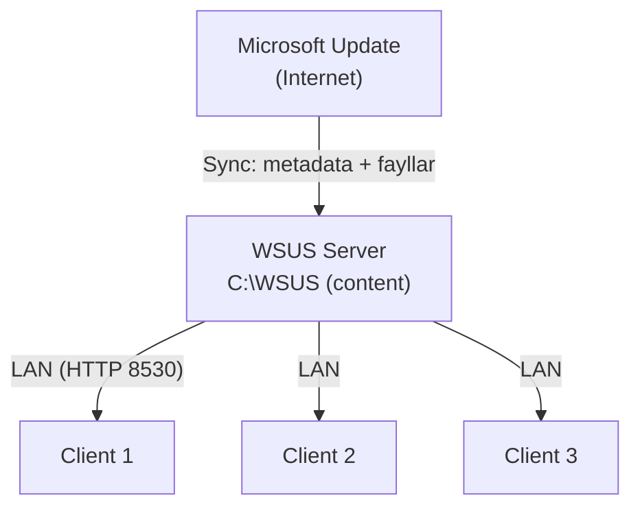
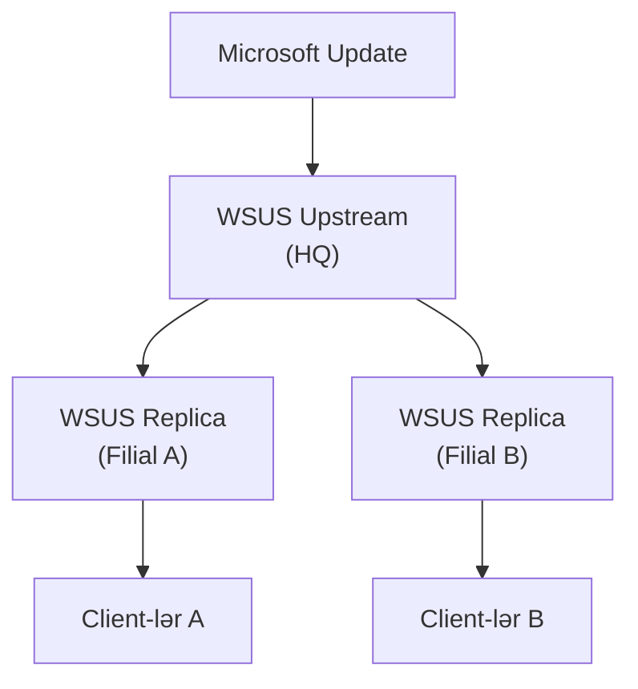

# WSUS (Windows Server Update Services)

Domain-dakı hər Windows maşın patch alır — security fix, bug fix, Defender definition. Nəzarətsiz buraxılsa, hər maşın eyni update-i birbaşa Microsoft Update-dən çəkir. İki noutbuk üçün bu məsələ deyil; iki yüz maşın üçün problemdir.

WSUS nə verir:

- Update-lər WSUS server-ə **bir dəfə** yüklənir, sonra LAN-dan paylanır — bandwidth qənaəti
- Konsol göstərir ki hansı maşında hansı update lazımdır / install olub / uğursuz olub
- Approval nəzarəti: admin nəyin install olunacağını, nəyin blok olunacağını seçir
- GPO ilə vaxt nəzarəti — bazar ertəsi 14:00-da yox, gecə 03:00-da patch
- Ring-əsaslı rollout: əvvəl **Test** qrupuna approve et, gözlə, sonra production-a

## Arxitektura



Çox filialı olan təşkilatlarda ikinci tier əlverişlidir:



**Upstream** server Microsoft-dan sync edir; **downstream / replica** server-lər upstream-dən sync edir və WAN üzərindən yalnız metadata üçün bandwidth istifadə edirlər — content yox.

## Komponentlər və database seçimi

| Komponent | Təyinat |
| --- | --- |
| WSUS Service | IIS-də hosted əsas xidmət |
| WSUS Database | Update metadata-sı + kompüter inventarı (WID və ya SQL Server) |
| Content Directory | Update binary-lərinin fiziki yeri (default `C:\WSUS`) |
| WSUS Console | İdarəetmə üçün MMC snap-in |

| | WID (Windows Internal Database) | SQL Server |
| --- | --- | --- |
| Qiymət | Pulsuz, built-in | Lisenziya lazım |
| Miqyas | ~20,000 client-ə qədər | Böyük enterprise |
| Remote console | Yalnız server özündən | Hər yerdən |
| Tövsiyə | Lab və kiçik-orta təşkilatlar | Böyük enterprise, shared SQL |

Lab və ya tək-saytlı domain üçün WID kifayətdir.

## Tələblər

- Minimum 10 GB boş yer, tövsiyə 40+ GB — update binary-ləri böyükdür
- 4 GB+ RAM tövsiyə
- IIS rol avtomatik gətirir
- Microsoft Update-ə çıxış üçün outbound HTTPS

## Rolun quraşdırılması

```powershell
Install-WindowsFeature UpdateServices -IncludeManagementTools
Install-WindowsFeature UpdateServices-WidDB
Install-WindowsFeature UpdateServices-Services

# Post-install konfiqurasiya — DB-ni yaradır, content directory-ni bağlayır
& "C:\Program Files\Update Services\Tools\wsusutil.exe" postinstall CONTENT_DIR=C:\WSUS
```

GUI yolu: **Server Manager → Add Roles and Features → Windows Server Update Services**. **WID Connectivity + WSUS Services** seç, content yolu göstər, wizard-ı bitir, sonra Server Manager bildirişlərindən **Post-Installation tasks**-ı işə sal.

`wsusutil postinstall` addımı **mütləqdir** — o olmadan database yaradılmır və konsol açılmır.

## İlkin konfiqurasiya wizard-ı

Konsolun ilk açılışı wizard-ı işə salır (sonradan **Options → WSUS Server Configuration Wizard**-dan açılır):

1. **Upstream server** — `Synchronize from Microsoft Update`; başqa WSUS-un replikası deyilsə
2. **Proxy** — şəbəkə outbound üçün tələb edirsə təyin et
3. **Connect to upstream** — product və classification kataloqunu çəkir. 5–15 dəq gözlə.
4. **Dillər** — yalnız əsl istifadə etdiyin dilləri seç. Hər əlavə dil disk tutur.
5. **Products** — update almaq istədiyin Microsoft məhsulları. Tipik Windows mühiti: `Windows Server 2025`, `Windows 11`, `Microsoft Defender Antivirus`, `Microsoft Edge`. Office / SQL / .NET istifadə etmirsənsə buraxma — disk şişirdir.
6. **Classifications** — `Critical Updates`, `Security Updates`, `Definition Updates`, `Update Rollups` seç. `Drivers`-dan keç (WSUS ilə idarəsi adətən səmərəli deyil), `Feature Packs / Service Packs / Upgrades` yalnız planın varsa.
7. **Sync schedule** — gündə bir dəfə, gecə (məsələn 03:00)
8. **Begin initial synchronization** — ilk sync saatlarla çəkir, çünki tam metadata kataloqu yüklənir. Sonrakı sync-lər dəqiqələrlədir.

## Computer groups

Default olaraq hər client `Unassigned Computers`-ə düşür. Rollout-u mərhələli etmək üçün öz qrupların lazımdır.

Tipik struktur:

- `Test` — əvvəl update alan bir neçə maşın
- `Servers` — domain serverləri
- `Workstations` — istifadəçi maşınları
- `Lab` — non-production

Konsolda qrup yarat (**Computers → All Computers → Add Computer Group**), sonra client-lərin qrupa necə düşəcəyini seç:

| Metod | Üzvlük harada təyin olunur | Nə vaxt |
| --- | --- | --- |
| Server-side targeting | WSUS konsolunda əl ilə | Kiçik fleet, birdəfəlik köçürmələr |
| Client-side targeting | GPO ilə (`Enable client-side targeting`) | Real deployment — üzvlük OU / policy-dən gəlir |

Client-side targeting üçün əvvəlcə **Options → Computers → "Use Group Policy or registry settings on computers"** aktiv et, sonra GPO-da target group adını təyin et.

## Approval

Update statusları:

| Status | Mənası |
| --- | --- |
| Not Approved | Hələ qərar yoxdur |
| Approved for Install | Target group-dakı client-lər quraşdıracaq |
| Approved for Removal | Client-lər uninstall edəcək |
| Declined | Görünüşdən gizlənib; client-lər görmür |

### Manual approval

**Updates → All Updates → filter Approval: Any Except Declined, Status: Needed**. Update üzərinə sağ klik → **Approve** → qrup və əməliyyat seç. Tipik axın: `Test`-ə approve, bir həftə gözlə, sonra `Workstations` və `Servers`-ə approve.

### Auto-approval qaydaları

**Options → Automatic Approvals → New Rule**. Sağlam başlanğıc qayda:

- Classifications: `Critical Updates`, `Security Updates`, `Definition Updates`
- Products: `Windows Server 2025`, `Windows 11`, `Microsoft Defender`
- Approve for: `Test`
- Ad: `Auto-Approve Security to Test`

Defender definition update-ləri adətən **bütün** qruplara auto-approve edilir — hər gün dəyişir, risk azdır, və həftə gözləmək məqsədi pozur.

### Decline etmək

Update üzərinə sağ klik → **Decline** — aid olmayan update-lər üçün (köhnə arxitekturalar, istifadə etmədiyin dil pack-lər, sahib olmadığın məhsullar). Decline olunmuş update-lər cleanup-da disk azad edir.

## Client-ləri WSUS-a yönləndirmək (GPO)

GPO olmadan client-lərin WSUS-dan xəbəri yoxdur. GPO yarat, domain-ə (və ya OU-ya) link et və bu parametrləri redaktə et:

**Computer Configuration → Policies → Administrative Templates → Windows Components → Windows Update → Manage updates offered from Windows Server Update Services** altında:

| Parametr | Dəyər |
| --- | --- |
| Specify intranet Microsoft update service location | Enabled — update və statistics URL-ləri üçün `http://DC01:8530` |
| Enable client-side targeting | Enabled — `Workstations` (bu OU-ya uyğun WSUS qrupu) |
| Do not connect to any Windows Update Internet locations | Enabled — client-ləri yalnız WSUS-a məcbur et |

**Manage end user experience** altında:

| Parametr | Dəyər |
| --- | --- |
| Configure Automatic Updates | Enabled — seçim **4** (auto-download + scheduled install), hər gün 03:00 |
| No auto-restart with logged on users for scheduled automatic updates installations | Enabled |

Port `8530` — WSUS HTTP portu. HTTPS `8531` istifadə edir — WSUS-client trafikini TLS ilə istəyirsənsə lazımdır, çox hardened mühit bunu tələb edir.

### Client-də tətbiq və yoxlama

```powershell
gpupdate /force

# Policy-nin enib-enmədiyini yoxla
reg query "HKLM\SOFTWARE\Policies\Microsoft\Windows\WindowsUpdate" /s
# Gözlənilən: WUServer = http://DC01:8530

Restart-Service wuauserv

# Detection və reporting-i məcbur et
wuauclt /detectnow
wuauclt /reportnow

# Server 2019+ və Windows 10/11
usoclient StartScan
```

Client 15–30 dəq ərzində WSUS konsolunda görünməlidir. Görünməsə, client-dən `Test-NetConnection DC01 -Port 8530` ilə başla.

## Reporting

Built-in hesabatlar — **WSUS Console → Reports**:

| Report | İstifadə |
| --- | --- |
| Update Status Summary | Mühit üzrə hər update-in statusu |
| Update Detailed Status | Hansı maşında hansı update lazımdır / uğursuz olub |
| Computer Status Summary | Hər maşın üzrə rollup |
| Computer Detailed Status | Hər maşının nələri qaçırdığı |
| Synchronization Results | Sync tarixçəsi |

PowerShell:

```powershell
$wsus = Get-WsusServer -Name "DC01" -PortNumber 8530

# Son sync
$wsus.GetSubscription().GetLastSynchronizationInfo()

# Mühitdə hələ lazım olan və ya uğursuz olan update-lər
Get-WsusUpdate -UpdateServer $wsus -Status FailedOrNeeded |
  Select Update, ComputersNeedingThisUpdate

# İnventar
Get-WsusComputer -UpdateServer $wsus |
  Select FullDomainName, IPAddress, LastReportedStatusTime, LastSyncTime
```

## Cleanup

WSUS database-i tez böyüyür və konsolu yavaşladır. Hər ay təmizlik aparın.

Console: **Options → Server Cleanup Wizard** — hər şeyi işarələ:

- Unused updates and update revisions
- Computers not contacting the server
- Unneeded update files
- Expired updates
- Superseded updates

PowerShell:

```powershell
Invoke-WsusServerCleanup `
  -CleanupObsoleteUpdates `
  -CleanupUnneededContentFiles `
  -CompressUpdates `
  -DeclineExpiredUpdates `
  -DeclineSupersededUpdates
```

Cleanup-dan sonra konsol yenə yavaşdırsa, **WsusPool** IIS application pool-unun private memory limit-ini qaldır (default 1.8 GB → 4 GB+) və Microsoft-un yayımladığı reindex script-i ilə WID database-i reindex et.

## Troubleshooting

**Client konsolda görünmür**

1. GPO tətbiq olunub: `gpresult /r | findstr WSUS`, sonra `WindowsUpdate` policy key-ini `reg query` et
2. `Get-Service wuauserv` — xidmət işləyir
3. Client-dən `Test-NetConnection DC01 -Port 8530`
4. `wuauclt /detectnow` + `wuauclt /reportnow`, 15 dəq gözlə

**Sync uğursuz olur**

1. Outbound internet işləyir: `Test-Connection microsoft.com`
2. Proxy düzgün konfiqurasiya olunub
3. Firewall WSUS port-larını çıxışda bloklamır
4. Xidmətləri restart et: `Restart-Service WsusService; iisreset`

**Disk doldu**

1. Cleanup wizard çalışdır
2. İstifadə etmədiyin product / classification-ı decline et, sonra cleanup
3. `Get-ChildItem C:\WSUS -Recurse | Measure-Object Length -Sum` ilə yerin hara getdiyini gör
4. Content directory-ni daha böyük volume-a köçür (`wsusutil movecontent`)

Əsas log yerləri:

| Log | Yol |
| --- | --- |
| Client update aktivliyi | `C:\Windows\SoftwareDistribution\` və `Get-WindowsUpdateLog` |
| WSUS change / control | `C:\Program Files\Update Services\LogFiles\` |

## Praktik nəticələr

- Heç vaxt birbaşa production-a patch etmə — əvvəl `Test` qrupu, gözlə, sonra promote
- Defender definition-ları hər yerə auto-approve, security update-ləri ring-lərə manual approve
- İstifadə etmədiyin product və classification-ı decline et — kataloq daha kiçik, database daha kiçik, disk daha kiçik
- Cleanup wizard-ı hər ay işə sal və DB cidd böyüdükcə WsusPool memory-ni qaldır
- Content-i OS diskindən ayrı volume-da saxla
- Patch etmədiyin server — itirəcəyin serverdir. WSUS patching-i darıxdırıcı etmək üçün var

## Faydalı linklər

- WSUS icmalı: [https://learn.microsoft.com/en-us/windows-server/administration/windows-server-update-services/get-started/windows-server-update-services-wsus](https://learn.microsoft.com/en-us/windows-server/administration/windows-server-update-services/get-started/windows-server-update-services-wsus)
- WSUS deploy: [https://learn.microsoft.com/en-us/windows-server/administration/windows-server-update-services/deploy/deploy-windows-server-update-services](https://learn.microsoft.com/en-us/windows-server/administration/windows-server-update-services/deploy/deploy-windows-server-update-services)
- WSUS-u GPO ilə konfiqurasiya: [https://learn.microsoft.com/en-us/windows-server/administration/windows-server-update-services/deploy/4-configure-group-policy-settings-for-automatic-updates](https://learn.microsoft.com/en-us/windows-server/administration/windows-server-update-services/deploy/4-configure-group-policy-settings-for-automatic-updates)
- WSUS-u PowerShell ilə idarə et: [https://learn.microsoft.com/en-us/powershell/module/updateservices/](https://learn.microsoft.com/en-us/powershell/module/updateservices/)
