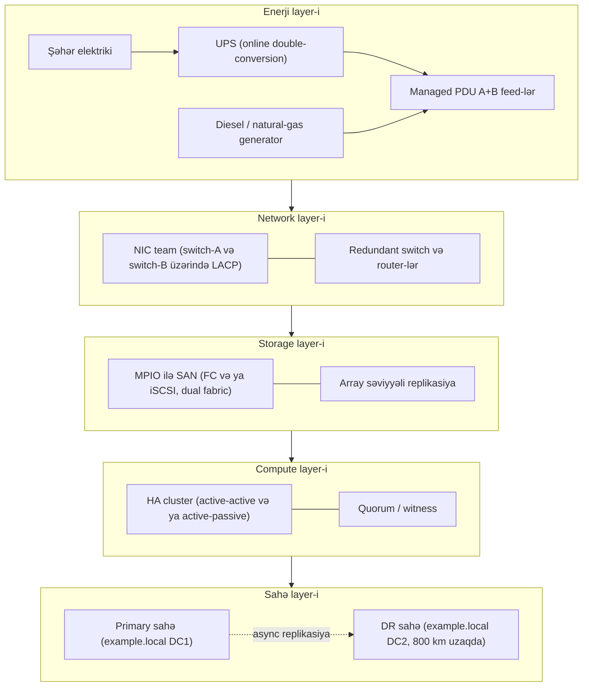

# Resilience and High Availability

Backup nəyinsə pozulmasından *sonra* etdiyin işdir. Resilience isə xidməti, sıradan çıxma *zamanı* da işlək saxlamaq üçün etdiyin işdir. Bunlar fərqli sahələrdir və ciddi əməliyyatda hər ikisi lazımdır.

`example.local`-da tipik bir səhər: UPS batareyası özünütestində alarm verir, `FS01`-də NIC link-i flap olur, Hyper-V host-da SAN path sarıya düşür. Bunların heç biri tək bir istifadəçinin gözünə dəyməməlidir. Bu xüsusiyyət — bir komponent ölə bilməsi, amma əməliyyat komandasından kənarda heç kimin xəbər tutmaması — resilience-in sənə qazandırdığı şeydir.

> Backup soruşur "datanı geri qaytara bilərikmi?" Resilience soruşur "istifadəçi heç fərq etdimi?"

Data itkisinin bərpası üçün [backup](./backup.md) səhifəsinə bax. Tək server daxilində redundant disk qrupları üçün [RAID](../../general-security/raid.md) səhifəsinə. Trafik bölgüsü və load balancer-lər üçün [network devices](../../networking/foundation/network-devices.md) səhifəsinə. Bu səhifə qalan hər şey haqqındadır: enerji, network path-ləri, storage path-ləri, replikasiya, sahələr və clustering.

## Niyə bu vacibdir

Backup yenidən qura biləcəyini sübut edir. Resilience isə yenidən qurmağa bu gün ehtiyac olmamasını təmin edir. `example.local` rack-ını şənbə günü saat 03:00-da təsəvvür et:

- Şəhər elektrikinin bir fazası düşür. UPS yükü bir AC tsiklində götürür. Beş dəqiqə sonra dizel generator işə düşür və yükü öz üzərinə alır. Heç kimə zəng gəlmir.
- `DC01`-in top-of-rack switch portu xarab olur. Server-də NIC teaming link itkisini görüb trafiki ikinci NIC-ə keçirir, o da fərqli switch-ə qoşulub. AD authentication işləməyə davam edir.
- SAN-dakı kontroller firmware update üçün reboot olur. Hər host-dakı MPIO uğursuz path-i atır və qalanı üzərində davam edir. SQL Server qısa I/O latency sıçrayışı log-layır və işləməyə davam edir.

Bunların hər biri komponent səviyyəsində real bir kəsintidir. Resilience stack-in işi onların *xidmət* səviyyəsində kəsintiyə çevrilməsinə imkan verməməkdir.

## Cybersecurity resilience

Resilience — sistemin nasazlığı udmaq və normal əməliyyata qayıtmaq qabiliyyətidir. Redundancy-dən genişdir — redundancy bunu əldə etmək üçün istifadə olunan üsullardan yalnız biridir.

NIST resilience-i Cybersecurity Framework-un (CSF) **Recover** funksiyası daxilində yerləşdirir, **Identify, Protect, Detect, Respond**-ın yanında. NIST SP 800-34 (contingency planning) və SP 800-160 vol. 2 (cyber resilience engineering) resilience-i bu mərhələlərin birləşməsi kimi təsvir edir:

- **Anticipate** — məlum sıradançıxma rejimləri üçün dizayn et
- **Withstand** — degradasiya zamanı işləməyi davam etdir
- **Recover** — hadisədən sonra tam performansa qayıt
- **Adapt** — öyrənilənlər əsasında təkmilləş

| Anlayış | Cavablandırdığı sual | Nümunə |
| --- | --- | --- |
| **Reliability** | Soruşduğum vaxtda işləyəcəkmi? | Beş il xətasız işləyən disk |
| **Availability** | Vaxtın hansı hissəsində ayaqdadır? | 99.9% (ildə təxminən 8.7 saat downtime) |
| **Resilience** | Nasazlıqdan sağ çıxıb davam edə bilərmi? | Bir PSU ölür, server digər PSU-da işləməyə davam edir |
| **Recovery** | Nasazlıqdan sonra geri qayıda bilərikmi? | Backup-dan bərpa, cluster-i yenidən qurmaq |

Tələ — high availability ilə resilience-i qarışdırmaqdır. Load balancer arxasında dörd-node-luq cluster yüksək uptime rəqəmləri verir, amma bütün dörd node eyni rack-da, eyni circuit-də olsa, tək bir PDU sıçrayışı bütün xidməti söndürür. Əsl resilience — sıradan çıxma rejimlərinin layer-lər boyunca müstəqil olması deməkdir: power, network, storage, compute və site.

## Geographic dispersal

Tək bir bina, mühəndis cəhətdən nə qədər yaxşı dizayn olunsa da, bir yanğın / sel / fiber kəsilməsi ilə tamamilə itə bilər. Geographic dispersal — infrastrukturun fiziki cəhətdən ayrı yerlərdə işlədilməsi praktikasıdır ki, bir hadisə hamısını bir anda yox etməsin.

### Sahə tier-ləri

DR sənayesi ikinci sahələr üçün üç klassik adlandırmadan istifadə edir:

| Sahə tipi | Hardware | Data | RTO | Maliyyət |
| --- | --- | --- | --- | --- |
| **Hot** | Production-la eyni, işlək | Daimi replikasiya | Dəqiqələr | Ən yüksək |
| **Warm** | Hazır, amma boşda / minimal | Gündə bir və ya daha tez-tez | Saatlar | Orta |
| **Cold** | Boş yer + enerji + network | Tape backup-dan bərpa | Günlər | Ən aşağı |

Tənzimlənən bank hot-hot işlədə bilər. Regional mühəndislik şirkəti async storage replikasiya ilə hot-warm işlədə bilər. Kiçik ofis cold + offsite cloud backup ilə kifayətlənə bilər.

### Sahə səviyyəsində active-active vs active-passive

İki sahən olduqda, yükü necə paylayacağını seçirsən:

- **Active-active multi-region** — hər iki sahə daim trafik xidmət edir; sıradan çıxma tutum azaldır, amma xidməti dayandırmır. Diqqətli data tutarlılığı dizaynı tələb edir (sinxron replikasiya, conflict həlli, və ya session-affinity routing).
- **Active-passive DR** — primary trafik xidmət edir, secondary sinxron saxlanılır, amma failover olana qədər boşdadır. Daha sadə, daha ucuz, lakin secondary ömrünün çox hissəsini sınanmamış keçirir.

### Məsafə və latency

Geographic dispersal pulsuz deyil — fiberdə işıq sürəti təxminən 200 km/ms round-trip-dir. Sinxron replikasiya təxminən 5 ms RTT-dən aşağını istəyir, bu da faydalı sync məsafəsini ~100 km ilə məhdudlaşdırır. Bundan uzağı fizika ilə avtomatik async olur.

Məsafəni real təhlükələrə qarşı seç: küçə qarşısındakı yanğın "fərqli bina" üçün kifayətdir, regional sel fərqli şəhər tələb edir, ölkə miqyaslı şəbəkə hadisəsi fərqli ölkə tələb edir.

## Multipath I/O (MPIO)

Server ilə onun block storage-ı arasında bir I/O fabric var — Fibre Channel, iSCSI, SAS, FCoE və ya NVMe-oF. Hər fabric-də switch-lər, kabellər, HBA-lar və storage kontrollerləri var və bunların hər biri sıradan çıxa bilər. Multipath I/O *eyni LUN*-u OS-ə bir neçə fiziki path üzərindən təqdim edir və hər I/O üçün hansı path-i istifadə edəcəyinə qərar verir.

MPIO iki şey gətirir:

- **Failover** — bir path düşsə, I/O sağ qalan üzərində davam edir
- **Load distribution** — daha yüksək throughput üçün bir neçə path paralel istifadə oluna bilər

### MPIO harada yaşayır

| Platforma | Komponent | Qeyd |
| --- | --- | --- |
| **Windows Server** | MPIO feature + DSM (Device-Specific Module) | `Install-WindowsFeature Multipath-IO`; HPE/Dell/Pure-dan vendor DSM-ləri qoşulur |
| **Linux** | `device-mapper-multipath` (DM-Multipath) | `/etc/multipath.conf`, path-lərə baxmaq üçün `multipath -ll` |
| **VMware vSphere** | Native Multipathing Plug-in (NMP) + SATP/PSP | `esxcli storage nmp` ailəsi |
| **Storage array** | ALUA (Asymmetric Logical Unit Access) | Host-a hansı path-lərin optimal vs qeyri-optimal olduğunu deyir |

### Path seçim siyasətləri

| Siyasət | Davranış | Nə vaxt istifadə |
| --- | --- | --- |
| **Failover only / Fixed** | Bir üstün path; yalnız sıradan çıxmada keç | ALUA-sız active-passive array-lər |
| **Round Robin** | I/O-nu bütün aktiv path-lər arasında dövr et | Müasir AFA-lar (all-flash array) |
| **Least Queue Depth** | Ən az gözləyən I/O-su olan path-i seç | Qarışıq yüklü mühitlər |
| **Weighted Paths** | Manual prioritetlər | Asimetrik link sürətləri |

Tipik sxem: host-da iki HBA, iki fabric (SAN-A və SAN-B), array-da iki kontroller, hər LUN üçün cəmi dörd path, round-robin siyasət, ALUA-aware DSM. Hər hansı bir kabel, switch və ya kontrolleri çıxarmaq I/O-nu kəsmir.

## NIC teaming və link aggregation

İki fiziki network adapteri olan server OS-ə tək məntiqi interfeys təqdim edə bilər. Team failover-i idarə edir və mod-dan asılı olaraq, həmçinin yük bölgüsünü.

### Teaming modları

| Mod | Standart | Switch-in iştirakı | Yük bölgüsü |
| --- | --- | --- | --- |
| **Active-backup** | Yox — yalnız host tərəfli | Yox | Yox (eyni anda yalnız bir NIC aktiv) |
| **Switch-independent / Round Robin** | Yox | Yox | Host tərəfində per-paket və ya per-flow |
| **LACP (802.3ad)** | IEEE 802.3ad | Bəli — switch konfiqurasiya olunmalıdır | Bütün üzvlər arasında hash əsasında |
| **Static / manual** | Yox | Bəli — manual təyin olunur | Hash əsasında, neqosiasiya yoxdur |
| **PAgP** | Cisco məxsusi | Bəli — yalnız Cisco switch-lər | Auto-neqosiasiya olunan EtherChannel |

LACP açıq standart cavabdır və vendorlar arasında işləyir. PAgP isə Cisco-nun köhnə, məxsusi ekvivalentidir — eyni ideya, amma yalnız hər ikisi onu danışan Cisco cihazları arasında. Yeni quraşdırmalar, xüsusi Cisco-only məhdudiyyət olmadıqca, LACP istifadə etməlidir.

### Tək nöqtəli sıradançıxma tələsi

Hər iki kabeli *eyni switch*-ə qoşulan NIC teaming NIC sıradançıxmasından qoruyur, amma switch sıradançıxmasından qorumur. Hər NIC-i fərqli switch-ə qoş (və switch tərəfində MLAG / VPC / stacking konfiqurasiya et ki, LACP onlar arasında işləsin) — switch kəsintisindən sağ çıxmağın yeganə yolu budur.

```
         host: team0 (LACP)
            |        |
        NIC eth0   NIC eth1
            |        |
        switch-A  switch-B           <- fərqli switch-lər, aralarında MLAG
            |        |
              core
```

## Power redundancy

Enerji — resilience stack-in təməlidir. Rack enerji itirsə, üstündəki heç nə əhəmiyyət daşımır. Bir-birini örtən dörd üsul:

### UPS (uninterruptible power supply)

UPS şəhər elektriki itməsi ilə generator işə düşməsi (və ya graceful shutdown) arasındakı saniyə-dəqiqə fasiləsini örtür.

- **Sizing** — **kVA**-da (apparent power) və **yükdə runtime**-da ölçülür. 80% yüklü 10 kVA UPS 8 kW verir; yük artdıqca runtime sürətlə düşür.
- **Topologiya** — *online* (double-conversion, daim invert edir, enerjini şərtləndirir) serverlər üçün qızıl standartdır. *Line-interactive* və *standby* daha ucuzdur, amma yükü keçid glitch-inə açıq qoyur.
- **Runtime hədəfi** — enterprise rack-də adətən 15-30 dəqiqə. Generator işə düşmək üçün, və ya işə düşməsə, host-ların graceful shutdown etməsi üçün kifayətdir.
- **Texniki xidmət** — aylıq batareya self-test, illik tam yük testi. Lithium UPS-lərə VRLA-dan az diqqət lazımdır, amma hələ də monitoring tələb edir.

### Generator

Şəhər elektriki saatlarla itəndə UPS batareyası bitir. Generator yanacaq olduğu müddətdə müddətsiz runtime verir.

| Yanacaq | Üstünlük | Mənfi |
| --- | --- | --- |
| **Diesel** | Yüksək enerji sıxlığı, yanacaq uzun raf ömrü | Fuel polishing lazımdır; emissiya qaydaları; həftəlik test işlətmələri |
| **Natural gas** | Borudan gəlir (yerində tank doldurmaq lazım deyil) | Eyni hadisədən sağ çıxan qaz şəbəkəsindən asılıdır |
| **Propane** | Diesel kimi yerində saxlanır; daha təmiz yanır | Daha aşağı enerji sıxlığı |

Generatorlar müntəzəm **yük altında test** olunmalıdır — ayda on dəqiqə yüksüz işləmək mühərrikin işə düşdüyünü sübut edir, amma datacenter yükünü çəkə biləcəyini sübut etmir.

### Dual power supply (A+B feed-lər)

Server PSU-ları, enerji verdikləri aşağı voltlu avadanlıqdan daha tez-tez sıradan çıxır. Müasir serverdə iki hot-swappable PSU var və ideal olaraq hər biri *fərqli* circuit-dən qidalanan *fərqli* UPS şaxəsindən gələn *fərqli* PDU-ya qoşulur.

```
  utility -----+-----------+----- utility (və ya generator)
               |           |
              UPS-A       UPS-B
               |           |
              PDU-A       PDU-B            <- A+B feed-lər
               |           |
            PSU-1        PSU-2             <- hər ikisi eyni serverdə
                  server
```

Hər hansı bir PDU-nu çıxarmaq heç nə etmir. Hər ikisini çıxarmaq serveri öldürür.

### Managed PDU

PDU — serverlərin qoşulduğu strip-dir. *Managed* PDU bunları əlavə edir:

- **Per-outlet remote keçid** — donmuş serveri laptop-undan power-cycle et
- **Per-outlet cərəyan monitorinqi** — qonşularından çox cərəyan çəkən serveri tut
- **Aggregate faza yükü** — rack-i üç-fazlı enerjinin ayaqları arasında balanslaşdır
- **Mühit sensorları** — rack-də temperatur/rütubət
- **Bildirişlər** — cərəyan həddi keçəndə və ya outlet sıçrayanda email / SNMP / syslog

Dolu rack 10-30 kVA çəkə bilər. Managed PDU olmadan, nəyinsə əriyənə qədər hansı serverlərin qaynar olduğunu bilməyəcəksən.

## Replikasiya pattern-ları

Replikasiya *canlı* datanın ikinci nüsxəsini daim güncəl saxlayır. O, resilience alətidir, backup aləti deyil — silmələrin və ransomware-in necə sədaqətlə replikasiya olunduğu üçün [backup](./backup.md) səhifəsinə bax.

| Mod | Necə işləyir | RPO | Latency qiyməti | Tipik istifadə |
| --- | --- | --- | --- | --- |
| **Synchronous** | Yazma yalnız hər iki sahədə diskdə olduqdan sonra app-a qayıdır | Sıfır | Hər yazıya round-trip latency əlavə edir | Metro / kampus, sub-5 ms RTT |
| **Asynchronous** | Primary dərhal təsdiq edir; secondary çatır | Saniyələr-dəqiqələr | Yazma path-ında yox | Cross-region, WAN |
| **Snapshot-based** | Periodik nöqtə-zamanda nüsxələr secondary-yə göndərilir | Snapshot intervalı (15 dəq, 1 saat, 24 saat) | Yox | DR, ransomware-davamlı nüsxələr |

Snapshot əsaslı replikasiya həm də "immutable secondary" pattern-ının təməlidir — DR array-dakı snapshot-lar read-only-dir və primary ransomware ilə şifrələnsə belə sağ qalırlar.

`example.local` mühitində adi texnologiyalar:

- **Storage Replica** (Windows Server) volume səviyyəli sync və ya async mirror üçün
- **Hyper-V Replica** VM səviyyəli async replikasiya üçün
- **DFS Replication** file share-lər üçün — bax [file server](./file-server-ntfs.md)
- **AD multi-master replikasiya** domain controller-lər arasında — bax [AD DS](../active-directory/active-directory-domain-services.md)
- **SAN-to-SAN array replikasiya** (HPE Peer Persistence, Dell PowerStore Metro, Pure ActiveCluster)

## Storage Area Network (SAN)

SAN — serverlərə block storage təqdim edən xüsusi yüksəksürətli network-dur. Serverlər SAN-attached storage-i sanki yerli disklər (LUN) kimi görür, amma əsl storage çox host qoşula bilən paylaşılan array-də yaşayır.

### Nəqliyyat protokolları

| Protokol | Layer | Bugünkü sürət | Qeyd |
| --- | --- | --- | --- |
| **Fibre Channel (FC)** | Xüsusi FC fabric | 16/32/64 Gb/s | Ən aşağı latency, ayrı kabel |
| **iSCSI** | Ethernet üzərində TCP/IP | 10/25/100 GbE | Daha ucuz, mövcud network avadanlığında işləyir |
| **FCoE** | Ethernet üzərində FC frame-lər | 10-100 GbE | Bu gün az yayılıb, əsasən legacy |
| **NVMe-oF** | FC, RoCE, və ya TCP üzərində NVMe | 25-200 GbE | Ən aşağı latency, yüksək performanslı yükləri ələ alır |

Tipik SAN rack: iki fabric-də (SAN-A və SAN-B) redundant FC switch-lər, hər host-da iki HBA (hər fabric üçün biri), hər array kontrollerinin hər iki fabric-də portları. MPIO hamısını birləşdirir — hər hansı switch, kabel, HBA və ya kontrolleri çıxarmaq əhəmiyyətsizdir.

### LUN masking və zoning

SAN paylaşılan resursdur, ona görə izolyasiyanı tətbiq etməlidir:

- **Zoning** — FC switch-də edilir; hansı initiator-un (HBA WWN) hansı target-i (array port WWN) görə biləcəyini idarə edir
- **LUN masking** — array-də edilir; hansı LUN-un hansı initiator-a görünəcəyini idarə edir

Hər ikisi düzgün konfiqurasiya olunmalıdır — yoxsa iki əlaqəsi olmayan host eyni LUN-a yazıb bir-birinin filesystem-lərini korlaya bilər.

## NAS vs SAN

NAS (Network Attached Storage) və SAN uzaqdan oxşar görünür — hər ikisi storage-i network-ə qoyur — amma fərqli layer-lərdə işləyirlər.

| Xüsusiyyət | NAS | SAN |
| --- | --- | --- |
| **Giriş səviyyəsi** | Fayl | Block |
| **Protokol** | SMB, NFS | FC, iSCSI, NVMe-oF |
| **Klient nə görür** | Network share | Yerli disk / LUN |
| **Filesystem sahibi** | NAS qurğusu | Klient OS |
| **Birgə multi-host** | Native (məqsəd budur) | Cluster filesystem lazımdır (CSV, VMFS, GFS2) |
| **Tipik istifadə** | İstifadəçi share-ləri, home directory-lər, backup target | VM datastore-ları, database-lər, transactional yüklər |
| **Tipik latency** | Yuxarı (TCP, fayl səviyyəli) | Aşağı (block, çox vaxt xüsusi fabric) |

Bir neçə klient eyni faylları paylaşmalıdırsa NAS seç. Server xammal block storage istəyirsə (yerli disk kimi davranan, latency həssas yük varsa) SAN seç. Bir çox mühitdə hər ikisi işləyir — daha geniş storage taksonomiyası üçün [storage and filesystems](./storage-filesystems-servers.md) səhifəsinə bax.

## High availability clustering

Clustering "iki server"-i "bir server itkisindən sağ çıxan bir xidmət"-ə çevirən şeydir. İki pattern üstünlük təşkil edir.

### Active-active

Bütün cluster node-ları daim trafik xidmət edir. Cluster proqram təminatı bölgünü (və ya qarşısındakı load balancer — bax [network devices](../../networking/foundation/network-devices.md)) idarə edir.

- **Üstünlük** — hər node-un hardware-i faydalı iş görür; sıradan çıxma tutum azaldır, xidməti dayandırmır
- **Mənfi** — təhlükəsiz bölünə bilən yük tələb edir (stateless web tier, sharded database, paralel app server-lər); diqqətli data tutarlılığı dizaynı tələb edir
- **Nümunələr** — load balancer arxasında web farm-lar, çox aktiv mailbox nüsxəsi olan Exchange DAG, SQL Server Always On read-scale

### Active-passive (failover)

Bir node yükü işlədir; digər(lər)i boşda təhvil almaq üçün gözləyir.

- **Üstünlük** — sadə model; eyni anda iki yerdə işləyə bilməyən legacy yüklər üçün işləyir (tək SQL writer, stateful file server)
- **Mənfi** — hardware-in yarısı (və ya çoxu) çox vaxt boşda; standby failover olana qədər sınanmamış qalır
- **Nümunələr** — tək rolu olan Windows Server Failover Cluster (WSFC), klassik SQL Server Failover Cluster Instance, file server cluster

### Shared storage vs shared-nothing

| Pattern | Node-lar datanı necə görür | Sıradançıxma modeli |
| --- | --- | --- |
| **Shared storage** | Bütün node-lar eyni SAN LUN-unu mount edir (WSFC-də CSV, vSphere-də VMFS) | Hər node hər rolu götürə bilər |
| **Shared-nothing** | Hər node yerli nüsxəyə sahibdir; data aralarında replikasiya olunur | Storage Spaces Direct (S2D), Galera, müasir NoSQL |

Shared storage MPIO və SAN tələb edir. Shared-nothing isə SAN-ı daha sürətli east-west network və replikasiya ilə əvəz edir.

### Quorum və split-brain

Ən təhlükəli cluster sıradan çıxması — **split-brain**-dir: cluster-in hər iki yarısı bir-biri ilə əlaqəni itirir, hər biri özünü sağ qalan elan edir və hər ikisi yazmağa başlayır. Bundan bərpa qarışıqdır və çox vaxt data itkisi ilə nəticələnir.

Müdafiə **quorum**-dur — bir anda yalnız bir bölmənin aktiv olmasını təmin edən səsvermə mexanizmi. Tipik yanaşmalar:

- **Node majority** — node-ların yarıdan çoxu sağ qalmalıdır (tək sayda işləyir)
- **Node + disk majority** — paylaşılan storage-da witness disk əlavə edir
- **Node + file share witness** — SMB share-də witness əlavə edir (ucuz, cluster-dən kənarda)
- **Cloud witness** (Azure / S3) — cloud storage-da kiçik blob, tiebreaker rolunda

Witness olmayan iki-node cluster gözləyən split-brain insidentidir. Həmişə witness konfiqurasiya et.

## Resilience stack

Layer-lər divar rozetkasından istifadəçiyə qədər yığılır:



Hər layer-in sıradan çıxması altındakı layer-lərdən müstəqil olmalıdır. Həm A, həm B feed-i söndürən tək bir sıçrayan breaker — layer-ləmə xətasıdır, enerji problemi deyil.

## Praktiki tapşırıqlar

1. **Windows Server-də NIC teaming.** İki NIC-li serverdə Server Manager (və ya PowerShell-də `New-NetLbfoTeam`) vasitəsilə **LACP team** konfiqurasiya et. Hər NIC-i fərqli switch-ə (və ya MLAG dəstəkləyən switch-ə) qoş. Başqa host-dan davamlı `ping -t` işləyərkən bir kabeli çıxar — sıfır (və ya bir) itirilmiş paket olmasını və trafikin sağ qalan üzərində davam etməsini yoxla.
2. **Test iSCSI target-ə qarşı Linux DM-Multipath.** `multipath-tools` quraşdır, initiator-u iki interfeysdə elan olunan iSCSI target-ə yönəlt, array üçün `/etc/multipath.conf`-i redaktə et, `multipath -ll` işlət və iki aktiv path-i təsdiqlə. Bir initiator NIC-i söndür və path-in düşməsini izlə.
3. **10 kW rack üçün UPS sizing.** Rack 10 kW (0.8 PF-də 12.5 kVA) çəkir. 80% yüklü əməliyyat üçün lazım olan UPS reytinqini, plus 30 dəqiqəlik avtonomluq əyrisinə malik 15 kVA UPS varsa runtime-i dəqiqələrlə hesabla. Fərziyyələri sənədləşdir: səmərəlilik, end-of-discharge gərginlik, batareya yaşı derating.
4. **Paylaşılan CSV storage ilə iki-node Hyper-V failover cluster.** `example.local`-a join olunmuş iki Hyper-V host qur, iSCSI üzərindən paylaşılan LUN təqdim et, Failover Cluster validation wizard-ı işlət, file-share witness ilə cluster yarat və LUN-u Cluster Shared Volume kimi əlavə et. İşləyən VM-i node-lar arasında köçür (Live Migration) və downtime olmamasını yoxla.
5. **Elektrik kabelini çıxararaq active-passive failover.** 4-cü tapşırıqdakı cluster Node-A-da aktiv olduğu halda, Node-A-nın PSU kabellərindən *birini* fiziki olaraq çıxar (bütün node-u öldürmə — bu 4b tapşırığıdır). İkinci PSU-nun node-u canlı saxladığını yoxla. Sonra hər ikisini çıxar və cluster-in VM-i Node-B-yə failover etməsini izlə. Kəsintinin müddətini ölç.

## İşlənmiş nümunə — regional DR sahə qurmaq

`example.local` şəhər mərkəzində tək datacenter (DC1) işlədir. Compliance reviewer-lər soruşur: şəhər miqyaslı hadisədən nə sağ çıxır?

**Dizayn.** Başqa regionda, 800 km uzaqda ikinci datacenter (DC2) əlavə et, redundant 1 Gb/s WAN ilə birləşdirilmiş.

| Layer | Primary (DC1) | Secondary (DC2) | Mexanizm |
| --- | --- | --- | --- |
| **Power** | Şəhər + UPS + diesel generator | Şəhər + UPS + diesel generator | Müstəqil şəbəkələr |
| **Network** | Dual ISP, BGP-routed | Dual ISP, BGP-routed | Failover-da DNS flip |
| **Storage** | All-flash SAN | All-flash SAN | Async array replikasiya, 15-dəq RPO |
| **AD** | DC01, DC02 (tam DC) | DC03 (DC2 sahəsində tam DC) | Native AD multi-master replikasiya |
| **VM yüklər** | Hyper-V cluster, ~40 VM | Hyper-V cluster, boşda | Hər 5 dəq Hyper-V Replica |
| **DNS / public giriş** | `app.example.local` -> DC1 VIP | DC2 VIP-də əvvəlcədən hazırlanmış qeyd | DNS TTL = 60 s, manual cutover |

**Hədəflər.** RPO 15 dəqiqə (qəbul olunan: ən çox son rüb saatlıq yazıları itir). RTO 4 saat (manual cutover, ops komandası DNS-i flip etməzdən əvvəl bütövlüyü yoxlamağa vaxt lazımdır).

**Failover məşqi (rüblük işlət).**

1. Şənbə günü saat 09:00-da simulyasiya edilmiş DC1 kəsintisini elan et.
2. DC2-də tutarlı nöqtə-zamanı tutmaq üçün replikasiyanı dayandır.
3. DC2 storage replika-larını read-write-a yüksəlt.
4. DC2 Hyper-V cluster-də VM-ləri replika nüsxələrindən qaldır.
5. DC03-də AD-nin sağlam olmasını və FSMO rollarının seize oluna bilməsini yoxla.
6. `app.example.local` DNS qeydini DC2 VIP-ə flip et.
7. Ofis network-undan kənarda olan test istifadəçisinin xidmətə daxil olub işlədiyini təsdiq et.
8. Keçən vaxtı, sıradan çıxan hər şeyi sənədləşdir və runbook-a geri ötür.

İstənilən DR sahənin ilk məşqi həmişə nə isə tapır — itkin firewall qaydası, unudulmuş sertifikat, yalnız DC1-də yaşayan xidmətdən sənədsiz asılılıq. Məqsəd elə budur.

## Troubleshooting və tələlər

- **Heç vaxt test edilməmiş HA cluster.** Bir ildir failover etmədiyin cluster ümiddir, high availability deyil. Aylıq nəzarət edilən failover-lar planla.
- **Tək switch-də NIC team.** Eyni fiziki switch-də hər iki NIC NIC sıradançıxmasından sağ çıxır, switch sıradançıxmasından yox. Switch-ləri çarpaz keç.
- **Vendorlar arasında səhv konfiqurasiya olunmuş LACP.** Uyğunsuz hash modları və ya dəstəklənməyən LAG ID flapping-ə səbəb olur. LACP istifadə et, hər iki ucda modları uyğunlaşdır və interfeys sayğaclarını izlə.
- **5 ildir yük altında test olunmamış UPS.** Batareyalar səssizcə yaşlanır. Self-test yüksüz yoxlamadan keçir; tam rack ilə real kəsinti UPS-in saxlaya biləcəyindən çox cərəyan çəkir. İllik tam yük testi yeganə sübutdur.
- **Heç vaxt yük altında işləməmiş generator.** Həftəlik yüksüz işə salma mühərrikin işə düşdüyünü sübut edir. Alternatorun 50 kW-ı altı saat çəkə biləcəyini sübut etmir. İldə ən azı bir dəfə *yüklü* test işlət.
- **Eyni PDU-ya qoşulmuş A+B feed-lər.** Tələsik qurulmuş rack-lərdə təəccüblü dərəcədə tez-tez. Hər kabeli mənbəsinə qədər izlə.
- **"Geo-redundant"-ın əslində eyni binada iki rack olması.** Secondary eyni enerji feed-ində və eyni fiber girişində-dirsə, geo-redundant deyil.
- **Failover zamanı uçuşdakı yazıların damcısını itirən async replikasiya.** Son bir neçə saniyə yazı çatmadı. RPO-nu dürüst sənədləşdir və ona uyğun dizayn et.
- **Quorum itirildikdə split-brain.** Witness olmayan iki-node cluster-lər və ya cluster ilə eyni sıradançıxma sahəsini paylaşan witness-lər. Həmişə müstəqil witness olsun.
- **Səhv path siyasətli MPIO.** Active-passive array-də round-robin hər iki kontrolleri döyür və biri hər digər I/O-nu rədd edir. Siyasəti array-in elan etdiyi ilə (ALUA SATP) uyğunlaşdır.
- **Eyni circuit-dən ikiqat PSU.** Eyni rack strip, eyni breaker. Bir sıçrayış hər ikisini öldürür.
- **Bandwidth ehtiyatı olmayan storage replica.** Ağır yazma partlayışında WAN saturasiya olur, replikasiya geri qalır, RPO səssizcə iki qat artır.
- **Failover üçün çox uzun DNS TTL.** 24 saatlıq TTL — qeydi flip etdikdən sonra klientlərin bir gün ölmüş sahəyə getməsi deməkdir. DR-də iştirak edən qeydlərdə 60-300 s istifadə et.
- **Sahələr arasında AD vaxt fərqi.** Kerberos 5 dəqiqədən çox drift-də sınır. Hər iki sahənin eyni etibarlı mənbədən NTP-sinxron olmasını təmin et.
- **DR sahəsində firewall qaydalarını yeniləməyi unutmaq.** Primary-nin qaydaları zamanla böyüdü; DR nüsxəsi altı ay köhnəlib. Firewall config-i kod kimi qiymətləndir və replikasiya et.
- **Cluster ilə eyni SAN-da quorum witness.** Witness datadan müstəqil sıradan çıxmalıdır. File-share və ya cloud witness adətən eyni array-dakı disk witness-dən təhlükəsizdir.
- **Hər sahə üçün tək ISP.** Hər sahədə bir upstream provayder ilə "Dual datacenter" — regional kəsintidən bir BGP misconfig uzaqdadır.
- **Failover üçün sənədləşdirilmiş runbook yox.** DC1 saat 02:00-da yanırsa, ops komandasına addım-addım təlimat lazımdır, lövhədə müzakirə yox.

## Əsas götürmələr

- Resilience nasazlıq zamanı üçündür; backup ondan sonra üçün. Hər ikisi lazımdır.
- Resilience stack-i aşağıdan yuxarıya qur: power -> network -> storage -> compute -> site. Hər layer üstündəki və altındakından müstəqil sıradan çıxmalıdır.
- LACP açıq standart NIC teaming protokoludur. PAgP yalnız Cisco-dur. Team-i iki switch-ə çarpaz keç, yoxsa tək nöqtəli sıradançıxman var.
- Production SAN host-da MPIO məcburidir. Path-seçim siyasətini array-in elan etdiyi ilə (ALUA, active-active, active-passive) uyğunlaşdır.
- Power redundancy bir-birini örtən dörd layer-dir: saniyələr üçün UPS, saatlar üçün generator, komponent sıradançıxması üçün dual supply, görünürlük və remote idarəetmə üçün managed PDU.
- Sinxron replikasiya = sıfır RPO, latency qiyməti. Async = kiçik RPO, latency qiyməti yox. Snapshot-lar = məntiqi korlanma və ransomware-ə qarşı ən güclü müdafiə.
- SAN MPIO ilə paylaşılan block storage verir; NAS paylaşılan fayllar verir. Onlar fərqli problemlər həll edir.
- Tutum üçün active-active, sadəlik üçün active-passive. Hər ikisinə split-brain-dən qaçmaq üçün quorum witness lazımdır.
- Geographic dispersal kifayət qədər uzaq olmalıdır ki, tək hadisə hər iki sahəni dağıtmasın. İlk məşq həmişə nə isə tapır — buna görə də məşq edirsən.
- Test edilməmiş resilience planı hekayədir, kontrol deyil.

## İstinadlar

- NIST SP 800-34 Rev. 1, *Contingency Planning Guide for Federal Information Systems* — [https://csrc.nist.gov/pubs/sp/800/34/r1/upd1/final](https://csrc.nist.gov/pubs/sp/800/34/r1/upd1/final)
- NIST SP 800-160 Vol. 2 Rev. 1, *Developing Cyber-Resilient Systems* — [https://csrc.nist.gov/pubs/sp/800/160/v2/r1/final](https://csrc.nist.gov/pubs/sp/800/160/v2/r1/final)
- NIST Cybersecurity Framework (CSF) 2.0 — Recover funksiyası — [https://www.nist.gov/cyberframework](https://www.nist.gov/cyberframework)
- IEEE 802.3ad / 802.1AX (Link Aggregation) — [https://standards.ieee.org/ieee/802.1AX/7430/](https://standards.ieee.org/ieee/802.1AX/7430/)
- CIS Benchmarks (storage və OS hardening) — [https://www.cisecurity.org/cis-benchmarks](https://www.cisecurity.org/cis-benchmarks)
- Microsoft MPIO icmalı — [https://learn.microsoft.com/en-us/windows-server/storage/mpio/mpio-overview](https://learn.microsoft.com/en-us/windows-server/storage/mpio/mpio-overview)
- Microsoft Failover Clustering quorum modları — [https://learn.microsoft.com/en-us/windows-server/failover-clustering/manage-cluster-quorum](https://learn.microsoft.com/en-us/windows-server/failover-clustering/manage-cluster-quorum)
- HPE Storage istifadəçi bələdçiləri (3PAR / Primera / Alletra Peer Persistence) — [https://www.hpe.com/info/storage](https://www.hpe.com/info/storage)
- Dell PowerStore / PowerMax replikasiya sənədləri — [https://www.dell.com/support](https://www.dell.com/support)
- Pure Storage ActiveCluster sənədləri — [https://support.purestorage.com](https://support.purestorage.com)
- Həmçinin bax: [backup](./backup.md), [storage and filesystems](./storage-filesystems-servers.md), [file server NTFS](./file-server-ntfs.md), [Active Directory Domain Services](../active-directory/active-directory-domain-services.md), [RAID](../../general-security/raid.md), [network devices and load balancers](../../networking/foundation/network-devices.md), [risk and privacy](../../grc/risk-and-privacy.md), [investigation and mitigation](../../blue-teaming/investigation-and-mitigation.md)
