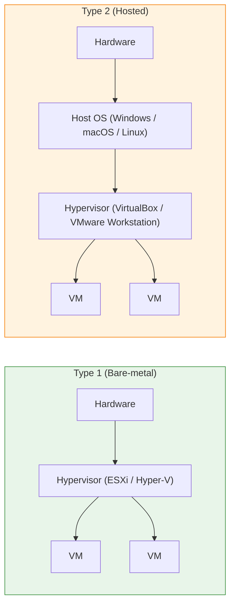

# Hypervisor və Virtualizasiya

Virtualizasiya bir fiziki hostun resurslarını çoxsaylı qonaq OS-lər arasında bölüşdürməyə imkan verir. Bu prosesi idarə edən komponent — CPU planlamasını, yaddaş bölgüsünü və virtual hardware-i hər VM-ə təqdim edən — **hypervisor** adlanır.

Geniş yayılmış virtualizasiya məhsulları:

- VMware — vSphere / ESXi (enterprise üçün sənaye standartı)
- Microsoft — Hyper-V
- Açıq mənbə — KVM, Xen

## Hypervisor nə edir?

Hypervisor fiziki hardware ilə qonaq OS-lər arasında yerləşir. Hər VM-ə virtual CPU, yaddaş, disk və şəbəkə təqdim edir və qonaqları bir-birindən izolyasiya edir.

VMware terminologiyasında **vSphere** və **ESXi** əlaqəlidir: ESXi hostda quraşdırılan bare-metal hypervisordur, vSphere isə daha geniş məhsul portfeli (ESXi + vCenter + idarəetmə alətləri) deməkdir.

## Type 1 vs Type 2

**Type 1 (bare-metal)**
- Birbaşa hardware üzərində işləyir
- Aşağı overhead, yüksək performans
- Production-da istifadə olunur: VMware ESXi, Microsoft Hyper-V, Xen, KVM

**Type 2 (hosted)**
- Host OS üzərində tətbiq kimi işləyir
- Aşağı performans, daha asan quraşdırma
- Lab və desktop üçün: VirtualBox, VMware Workstation, Parallels

## Type 1-in daxili dizaynı

Type 1 ailəsi daxilində iki arxitektura yanaşması var:

| Dizayn | Driver-lər harada yerləşir | Hypervisor həcmi | Nümunə |
| --- | --- | --- | --- |
| Microkernel | Hər VM-in daxilində | Kiçik | Hyper-V |
| Monolithic | Hypervisor-un özündə | Daha böyük | ESXi |

Microkernel dizaynda driver-lər imtiyazlı valideyn partisiyasında saxlanılır (Hyper-V üçün bu Windows işlədən root partisiyasıdır). Monolithic dizaynda driver-lər hypervisor-un daxilindədir.

## Type 1 vs Type 2 müqayisəsi

| | Type 1 | Type 2 |
| --- | --- | --- |
| Quraşdırma hədəfi | Birbaşa hardware | Host OS üzərinə |
| Performans | Yüksək | Orta |
| İzolyasiya | Güclü | Zəif (host OS-dən asılı) |
| Tipik istifadə | Production | Test, lab, inkişaf |
| Nümunələr | ESXi, Hyper-V, KVM | VirtualBox, VMware Workstation |

## Virtual maşınlar

Virtual maşın fiziki kompüterin proqram təsviridir. Hər VM-in öz virtual CPU, RAM, disk və NIC-i olur və hostdakı digər VM-lərdən asılı olmayan öz qonaq OS-unu işlədir.

## Virtualizasiya kateqoriyaları

| Kateqoriya | Nə virtuallaşdırır | Nümunə |
| --- | --- | --- |
| Server / compute | Fiziki server tutumu | VMware vSphere, Hyper-V |
| Network | Switch, router, firewall | VMware NSX |
| Storage | Storage pool-ları | VMware vSAN |
| Desktop | Son istifadəçi desktop-ları | VDI — Citrix, Horizon |

## Hyper-threading

Hyper-threading hər fiziki nüvəni OS və hypervisor planlayıcısına iki məntiqi nüvə kimi təqdim edir. Yük yaddaş və ya I/O gözləntisində vaxt sərf etdikdə throughput-a kömək edir, amma faktiki hesablama tutumunu iki dəfə artırmır. Enterprise lisenziyaların çoxu fiziki nüvə sayına əsaslanır, məntiqi thread-lərə yox.

## Server üçün out-of-band idarəetmə

Enterprise serverlərin əksəriyyəti ayrıca idarəetmə interfeysləri ilə gəlir ki, OS offline olsa belə hardware-i idarə etmək mümkündür:

| Satıcı | Alət |
| --- | --- |
| HPE | iLO (Integrated Lights-Out) |
| Dell | iDRAC |
| Lenovo | XClarity Controller |

Əlavə olaraq satıcıların install helper-ləri (HPE Intelligent Provisioning, Dell Lifecycle Controller) server firmware-də yerləşir və ayrıca smart CD olmadan OS deployment-ı sürətləndirir.

## Praktik nəticələr

- Production üçün həmişə Type 1 hypervisor seçin
- Hyper-threading throughput-u artırır, amma lisenziya hesablamasında fiziki nüvəni əvəz etmir
- Datastore və şəbəkə dizaynını hypervisor satıcısına uyğunlaşdırın (ESXi üçün VMFS/NFS, Hyper-V üçün CSV)
- Out-of-band idarəetmə interfeysini (iLO/iDRAC) hücum səthinin hissəsi sayın və seqmentləşdirin

## Faydalı linklər

- Hyper-V ümumi baxış: [https://learn.microsoft.com/en-us/windows-server/virtualization/hyper-v/hyper-v-technology-overview](https://learn.microsoft.com/en-us/windows-server/virtualization/hyper-v/hyper-v-technology-overview)
- VMware vSphere sənədləri: [https://docs.vmware.com/en/VMware-vSphere/index.html](https://docs.vmware.com/en/VMware-vSphere/index.html)
- Virtualizasiya seçim bələdçisi: [https://learn.microsoft.com/en-us/azure/architecture/guide/technology-choices/compute-decision-tree](https://learn.microsoft.com/en-us/azure/architecture/guide/technology-choices/compute-decision-tree)
